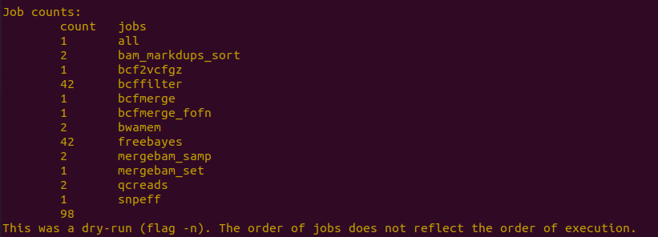
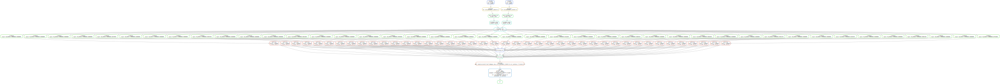
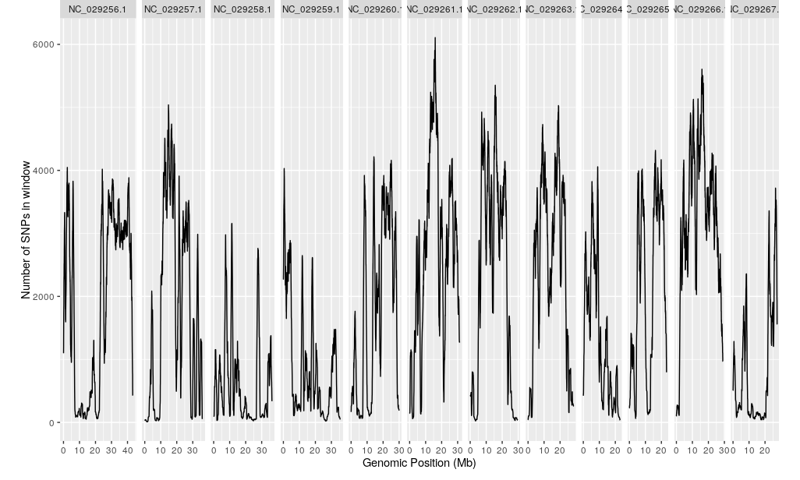
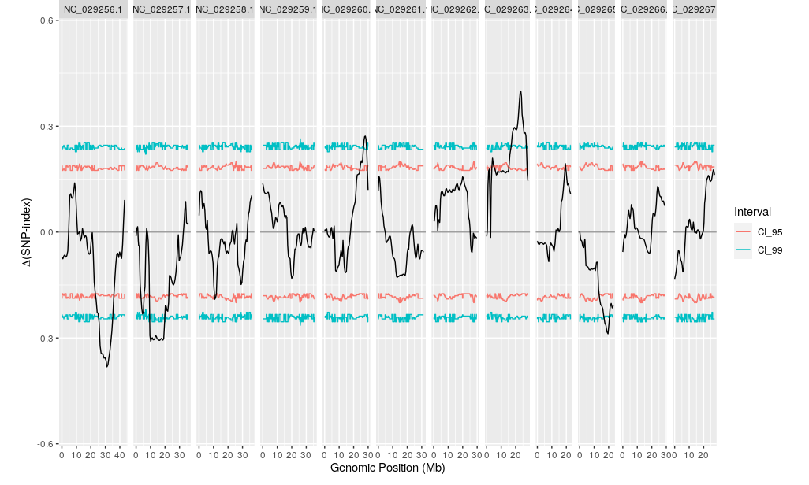
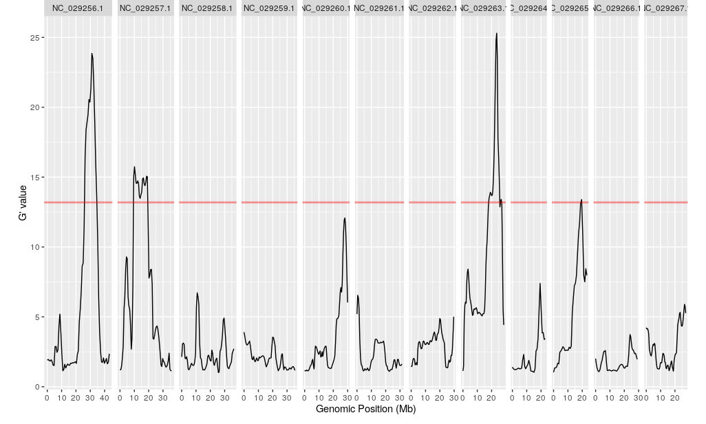
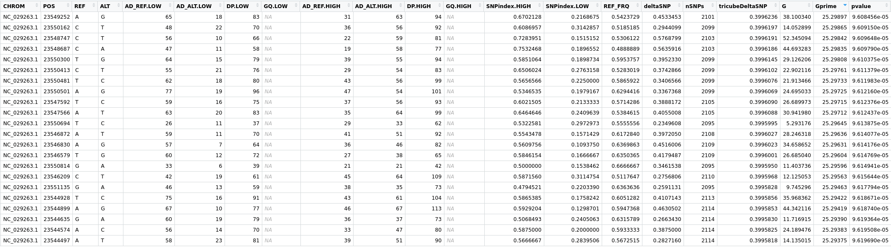
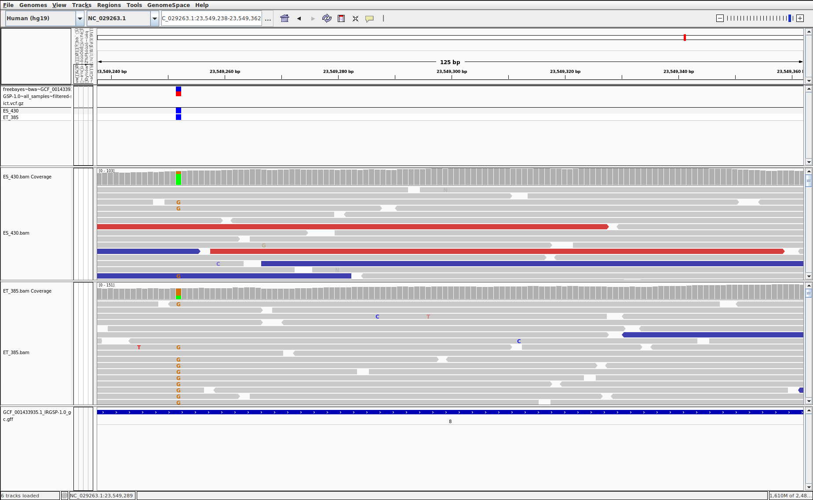
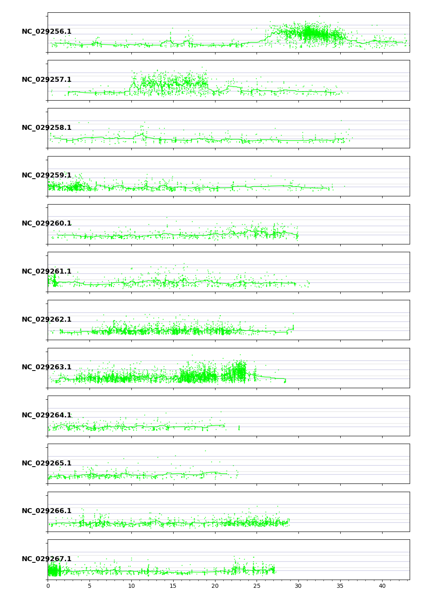
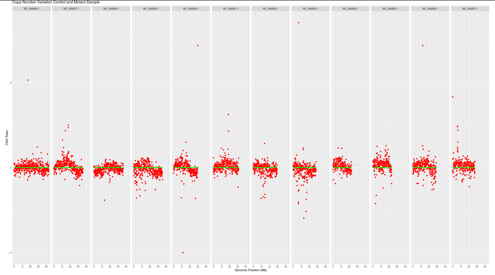

================================================================================
A PBGL Snakemake Workflow and Quatitative Trait Locus on Bulk Segregant Analysis 
================================================================================

=====================
:Author: Michael Hall
:Date: 07/18/2022
====================

Software Prerequisites
======================

#sra-toolkit
#Download git repository:

.. code:: shell

   #Clone pbgl DNA Proto Workflow
	git clone https://github.com/pbgl/dna-proto-workflow.git

	#Change Directory to root or project
	cd dna-proto-workflow

	#Create virtual environment
	Mamba env create --file env/all-dependencies.yml

	#Activate the environment
	conda activate dna-proto

	#Make a new directory FASTQ
	mkdir FASTQ

	#Change directory to FASTQ
	cd FASTQ

	#Download data from NCBI
	#Start with Extremely Tolerant Rice Pool ("Mutant")
	wget https://sra-pub-run-odp.s3.amazonaws.com/sra/SRR834931/SRR834931

	#Use sra-toolkit to split SRA into foward and reverse FASTQ reads and compress the files
	fastq-dump --gzip --split-3

	#Rename foward and reverse read files
	ET_385_1.fq.gz
	ET_385_2.fq.gz

	#Now get Extremely Sensitive Rice Pool ("Wild-Type")
	wget https://sra-pub-run-odp.s3.amazonaws.com/sra/SRR834927/SRR834927

	#Use sra-toolkit to split SRA into foward and reverse FASTQ reads and compress the files
	fastq-dump --gzip --split-3

	#Rename foward and reverse read files
	ES_430_1.fq.gz
	ES_430_2.fq.gz

	#Follow technical documentation for the DNA Prototype Workflow
	https://dna-proto-workflow-master.readthedocs.io/en/latest/

	#Download Reference Genome and Index it
	#Download annotation files (gff, gtf, protein)
	#Build a snpEFF configuration file with soft links if necessary or preferred.
	#Provide Meta Data information (Contigs of interest, sample sets and definitions)
	#Configure config.yml and snpEff.config to match file pathways and names.\

	#Test your workflow on a dry-run
	snakemake -npr

.. code:: shell

	snakemake --dag -npr -j 1 | dot -Tsvg > dag.svg

.. _a link: https://raw.githubusercontent.com/PBGLMichaelHall/Oryza_Satvia_Snakemake/main/dag.svg

.. raw:: html

   <A HREF="https://htmlpreview.github.io/?https://github.com/PBGLMichaelHall/Oryza_Satvia_Snakemake/blob/main/freebayes%7Ebwa%7EGCF_001433935.1_IRGSP-1.0%7Eall_samples%7Efiltered-strict.html">VariantHTML</A>

.. code:: shell

	snakemake -j 4 -kpr 

	#After PBGL Dna prototype pipeline root directory contains 634 items amounting to 271.4 Gigabytes 
	#There should be a vcf file in output variants final, lets take a look!

	bcftools view /home/michael/dna-proto-workflow/output/variants/final/freebayes~bwa~GCF_001433935.1_IRGSP-1.0~all_samples~filtered-strict.vcf.gz | less -S
   
	#Filter variants for biallelic sites only and SNPS types

	bcftools view -m2 -M2 -v snps -o freebayes~bwa~GCF_001433935.1_IRGSP-1.0~all_samples~filtered-strict.Biallelic.vcf.gz freebayes~bwa~GCF_001433935.1_IRGSP-1.0~all_samples~filtered-strict.vcf.gz

	#Follow pbgl online documentation

	https://github.com/pbgl/QTLseqr

	conda deactivate dna-proto

	#Create and activate new R Environment

	mamba env create --file env/R.yaml

	
	#Set samples
	HighBulk <- "ET_385" # SRA-run: SRR834931
	LowBulk <- "ES_430" # SRA-run: SRR834927 

	#set file name of the VCF file to load
	file <- "freebayes~bwa~GCF_001433935.1_IRGSP-1.0~all_samples~filtered-strict~snpEff.Biallelic.vcf.gz"

	#Specify which chromosomes should be included in the analysis (i.e., exclude smaller contigs)
	Chroms <- c("NC_029256.1",
        "NC_029257.1",
        "NC_029258.1",
        "NC_029259.1",
        "NC_029260.1",
        "NC_029261.1",
        "NC_029262.1",
        "NC_029263.1",
        "NC_029264.1",
        "NC_029265.1",
        "NC_029266.1",
        "NC_029267.1")
	df <- 
	importFromVCF(
	file = file,
	highBulk = HighBulk,
	lowBulk = LowBulk,
	chromList = Chroms
	)

	df_filt <-
	filterSNPs(
	SNPset = df,
	refAlleleFreq = 0.20,
	minTotalDepth = 70,
	maxTotalDepth = 200,
        minSampleDepth = 30,
        depthDifference = 100,
        #minGQ = 150,
        verbose = TRUE
        )

	df_filt <- 
        runGprimeAnalysis(
        SNPset = df_filt,
        windowSize = 1e6,
        outlierFilter = "deltaSNP",
        filterThreshold = 0.1
        )

	df_filt <- 
        runQTLseqAnalysis(
        SNPset = df_filt,
        windowSize = 1e6,
        popStruc = "F2",
        bulkSize = c(385, 430), 
        replications = 10000,
        intervals = c(95, 99)
        )

	plotQTLStats(SNPset = df_filt, var = "nSNPs", plotIntervals = TRUE)

	
.. code:: shell

	plotQTLStats(SNPset = df_filt, var = "deltaSNP", plotIntervals = TRUE)

	
.. code:: shell

	plotQTLStats(SNPset = df_filt, var = "Gprime", plotThreshold = TRUE, q = 0.02)

.. code:: shell

	df_filt$p1 <- df_filt$AD_ALT.LOW/df_filt$DP.LOW
	df_filt$p2 <- df_filt$AD_ALT.HIGH/df_filt$DP.HIGH
	df_filt3 <- df_filt %>% dplyr::filter(CHROM=="NC_029263.1")
	#Perhaps my filter is biased, but here it is. I want observed variants with pvalues below a significant threshold.
	df_filt4 <- df_filt3 %>% dplyr::filter(pvalue < .0000962)
	write.csv(df_filt3,file = "QTL.csv",sep=",")

	#Now, we open up Integrative Genomic Viewer to further analyze the most significant variant called to validate information.

.. code:: shell

	bash IGV.sh

Painting The Chromosomes Green
==============================

.. code:: shell
   
	# Clone VCF Hunter from github
	git clone https://github.com/SouthGreenPlatform/VcfHunter.git
	cd VcfHunter

	# Use vcf from Snakemake workflow as in input file to Filter it according to python script vcfFilter.1.0.py
	python vcfFilter.1.0.py --vcf freebayes~bwa~GCF_001433935.1_IRGSP-1.0~all_samples~filtered-strict~snpEff.vcf.gz --names Oryza_Satvia_Snakemake/PaintTheChromosomes/all_names.tab  --MinCov 10 --MaxCov 300 --MinAl 3 --nMiss 1 --RmAlAlt 1:3:4:5:6 --prefix DNAseq_Filtered -g y

	#Use vcftools to split vcf into independent vcf files per chromosome
	vcftools --gzvcf DNAseq_Filtered_filt.vcf.gz --chr NC_029256.1 --recode --out data/Chr01_DNAseq_Filtered.vcf.gz
	vcftools --gzvcf DNAseq_Filtered_filt.vcf.gz --chr NC_029256.1 --recode --out data/Chr01_DNAseq_Filtered.vcf.gz
	vcftools --gzvcf Downloads/VcfHunter/bin/DNAseq_Filtered_filt.vcf.gz --chr NC_029257.1 --recode --out data/Chr02_DNAseq_Filtered.vcf.gz
	vcftools --gzvcf DNAseq_Filtered_filt.vcf.gz --chr NC_029258.1 --recode --out data/Chr03_DNAseq_Filtered.vcf.gz
	vcftools --gzvcf DNAseq_Filtered_filt.vcf.gz --chr NC_029259.1 --recode --out data/Chr04_DNAseq_Filtered.vcf.gz
	vcftools --gzvcf DNAseq_Filtered_filt.vcf.gz --chr NC_029260.1 --recode --out data/Chr05_DNAseq_Filtered.vcf.gz
	vcftools --gzvcf DNAseq_Filtered_filt.vcf.gz --chr NC_029261.1 --recode --out data/Chr06_DNAseq_Filtered.vcf.gz
	vcftools --gzvcf DNAseq_Filtered_filt.vcf.gz --chr NC_029262.1 --recode --out data/Chr07_DNAseq_Filtered.vcf.gz
	vcftools --gzvcf DNAseq_Filtered_filt.vcf.gz --chr NC_029263.1 --recode --out data/Chr08_DNAseq_Filtered.vcf.gz
	vcftools --gzvcf DNAseq_Filtered_filt.vcf.gz --chr NC_029264.1 --recode --out data/Chr09_DNAseq_Filtered.vcf.gz
	vcftools --gzvcf DNAseq_Filtered_filt.vcf.gz --chr NC_029265.1 --recode --out data/Chr10_DNAseq_Filtered.vcf.gz
	vcftools --gzvcf DNAseq_Filtered_filt.vcf.gz --chr NC_029266.1 --recode --out data/Chr11_DNAseq_Filtered.vcf.gz
	vcftools --gzvcf DNAseq_Filtered_filt.vcf.gz --chr NC_029267.1 --recode --out data/Chr12_DNAseq_Filtered.vcf.gz

	#Use python script to produce an allelic frequency plot
	python vcf2allPropAndCovByChr.py --conf config/Rice.conf --origin config/RiceOrgin.tab --acc D2_F2_tt --ploidy 2 --dcurve y --col /config/Color.conf --NoMiss --all y 
	python vcf2allPropAndCovByChr.py --conf config/Rice.conf --origin config/RiceOrigin.tab --acc ES_430,ET_385 --ploidy 2 --NoMiss --all y

	#Allelic Frequency Plot (Tolerant Pool ET_385)

HIGH IMPACT VARIANTS in QTL Region
==================================

.. code:: shell 
	
	Download:
	SNPEff.latest
	https://pcingola.github.io/SnpEff/download/

	cd snpEff

	cat freebayes~bwa~GCF_001433935.1_IRGSP-1.0~all_samples~filtered-strict~snpEff.vcf | scripts/vcfAnnFirst.py | java -jar SnpSift.jar extractFields - CHROM POS ID REF ALT QUAL FILTER "ANN[*].IMPACT" FORMAT ES_430 ET_385 > impact.tsv

	#Import Data into R

	All_HIGH_IMPACT <- impact %>% dplyr::filter(ANN....IMPACT == "HIGH")
	df_filt2 <- All_HIGH_IMPACT  %>% dplyr::filter(CHROM=="NC_029263.1")
	#QTL 1 Region on Chromosome 8 from QTL.csv file
	df_filt2 <- df_filt2 %>% dplyr::filter(POS >= 17944918 & POS <= 25698533)
	df_filt2 <- df_filt2 %>% dplyr::select(POS)
	write.table(df_filt2,file="All_High_Impact.txt",row.names=FALSE,col.names=FALSE)
	

	#We know from QTL.csv Chromosome 6 "NC_029263.1" has a QTL peak in the range of positions 17944918 - 25698533!
	#Filter original SNP set to include this range of positions on Chromosome 8

	df_filt <- df_filt %>% dplyr::filter(CHROM=="NC_029263.1")
   
	#QTL1 Region
        df_filt <- df_filt %>% dplyr::filter(POS >= 17944918 & POS <= 25698533)
	#Significant SNP
	df_filt <- df_filt %>% dplyr::filter(pvalue < .05)
	#Write a text file
	write.table(df_filt, file = "POSQTL1.txt",col.names = FALSE)

	#Use MatchList.py script to find Variants that are
	nano MatchList.py 
	#Make sure file names match what you wrote
	

	#R Script
	#df1 <- data.frame(POS1=c(123,457,666,789))
	#df2 <- data.frame(POS2=c(123,444,566,789))
	#write.table(df1,file="Variant1.txt",col.names = FALSE,row.names = FALSE)
	#write.table(df2,file="Variant2.txt",col.names = FALSE,row.names = FALSE)
	import pandas as pd
	with open("POSQTL1.txt") as file:
        list1 = []
        for line in file:
        list1.append(line.strip())
        #print(list1)
	with open("All_High_Impact.txt") as file:
        list2 = []
        for line in file:
        list2.append(line.strip())
        #print(list2)
	found = []
	for i in list1:
        for j in list2:
        if j in i:
            found.append(j)
	#print(found)
	#print(type(found))
	found=','.join(found)
	#print(found)
	#print(type(found))
	df = pd.DataFrame([x.split(',') for x in found.split('/n')])
	#print(df.transpose())
	#print(df)
	#print(type(df))
	dfT = df.T
	df9=dfT.drop_duplicates()
	print(df9)
	#print(df9['[0]'])

        python MatchList.py
	
	18398803
   	18519533
   	18593921
   	19148067
   	19715648
   	21045530
   	21093745
   	22286217
   	22636828
   	23063312
  	23591197
  	24582019
  	24753987
  	24772963
  	24775242
  	24775287
  	24785765
  	24854393
	
	

====================
Copy Number Variants
===================

.. code:: shell

	#Following protocol from 
	https://github.com/PBGLMichaelHall/CNVseq
	#Remove duplicates from original NCBI fastq foward and reverse Illumina Runs
	bash clumpify.sh in=../../../dna-proto-workflow/FASTQ/ES_430_1.fq.gz in2=../../../dna-proto-workflow/FASTQ/ES_430_2.fq.gz out=ES_430.R1.dedup.fq.gz out2=ES_430.R2.dedup.fq.gz dedupe=t -Xmx4096m
	bash clumpify.sh in=../../../dna-proto-workflow/FASTQ/ET_385_1.fq.gz in2=../../../dna-proto-workflow/FASTQ/ET_385_2.fq.gz out=ET_385.R1.dedup.fq.gz out2=ET_385.R2.dedup.fq.gz dedupe=t -Xmx4096m

	bwa mem -M -t 3 -R '@RG\tID:ES430 \tSM: ES430' ../../dna-proto-workflow/genomes_and_annotations/GCF_001433935.1_IRGSP-1.0/GCF_001433935.1_IRGSP-1.0_genomic.fna ES_430.R1.dedup.fq.gz ES_430.R2.dedup.fq.gz > ES430.dedup.sam
	bwa mem -M -t 3 -R '@RG\tID:ET385 \tSM: ET385' ../../dna-proto-workflow/genomes_and_annotations/GCF_001433935.1_IRGSP-1.0/GCF_001433935.1_IRGSP-1.0_genomic.fna ET_385.R1.dedup.fq.gz ET_385.R2.dedup.fq.gz > ET385.dedup.sam
	
	samtools sort -O sam -T sam -T ES430.sort -o ES430_aln.sam ES430.dedup.sam 
	samtools sort -O sam -T sam -T ET385.sort -o ET385_aln.sam ET385.dedup.sam

	python bin-by-sam_2.0.py -o 100Kbin.txt -s 100000 -b -p 2 -c ES430_aln.sam

	#Open an R-Studio Session
	devtools::install_github(repo="PBGLMichaelHall/CNVseq",force=TRUE)
	library(CNV)
	CNV::CNV(file = "100Kbin.txt", Chromosome = c("NC_029256.1","NC_029257.1","NC_029258.1","NC_029259.1","NC_029260.1","NC_029261.1","NC_029262.1","NC_029263.1","NC_029264.1","NC_029265.1","NC_029266.1","NC_029267.1"),mutantname="ET385.ES430",controlname="ES430.ES430",size=.75,alpha=.25,color="green")

